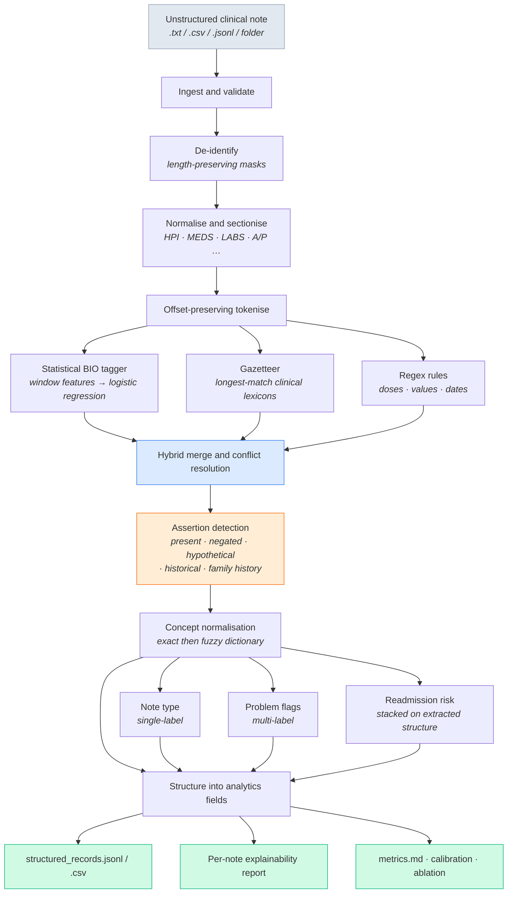

# Clinical Document NLP Pipeline

**End-to-end NLP workflow that turns unstructured clinical notes into structured, analytics-ready fields — with an explanation attached to every prediction.**


A discharge summary is a wall of prose. An analytics team needs rows: which problems, which drugs at which doses, which labs out of range, which of those were actually *ruled out*. This repository is the full path between those two things — ingestion, de-identification, sectionisation, hybrid named-entity recognition, assertion detection, concept normalisation, document classification, structuring, evaluation, and an explainability report for every single prediction.

It runs end to end in about **35 seconds on one CPU core**, with **no model downloads, no GPU and no API keys**:

```bash
pip install -r requirements.txt
python -m clinical_nlp.cli --config configs/default.yaml run
```

Everything in [`outputs/`](outputs/) is committed, so you can read the results before running anything. Start with **[`outputs/metrics.md`](outputs/metrics.md)** for performance and **[`outputs/explanations/`](outputs/explanations/)** for the per-note HTML reports.

---

## Contents

- [What it does](#what-it-does)
- [Quickstart](#quickstart)
- [Results](#results)
- [Explainability](#explainability-the-part-that-matters)
- [Design decisions](#design-decisions-and-why)
- [Repository layout](#repository-layout)
- [Outputs](#outputs)
- [Using it on your own notes](#using-it-on-your-own-notes)
- [Extending it](#extending-it)
- [Limitations](#limitations)

---

## What it does



A static version lives at [`docs/architecture.svg`](docs/architecture.svg); the stage-by-stage walkthrough is in [`docs/architecture.md`](docs/architecture.md).

### In, and out

**In** — an excerpt of [`outputs/sample_note.txt`](outputs/sample_note.txt):

```
HISTORY OF PRESENT ILLNESS
55 year old male with a past medical history of depression who presents with
community acquired pneumonia. Symptoms are also concerning for fever. No
evidence of cellulitis. Family history is notable for mother with diabetic
ketoacidosis. Patient has had 1 hospital admission(s) in the last 12 months.

DISCHARGE MEDICATIONS
Patient was continued on vancomycin 1 g IV q12h, piperacillin-tazobactam
3.375 g IV q6h and atorvastatin 40 mg PO nightly.
```

**Out** — a row an analyst can query, abridged from [`outputs/sample_structured_record.json`](outputs/sample_structured_record.json):

```jsonc
{
  "doc_id": "NOTE-00510",
  "note_type": "progress_note",
  "readmission_risk": "medium",
  "problem_flags": ["pneumonia", "sepsis"],
  "problems": [
    {"concept": "Major depressive disorder", "code": "F32.9",
     "assertion": "historical", "section": "HPI",        "confidence": 0.999},
    {"concept": "Community acquired pneumonia", "code": "J18.9",
     "assertion": "present",    "section": "HPI",        "confidence": 0.999},
    {"concept": "Fever", "code": "R50.9",
     "assertion": "present",    "section": "ASSESSMENT", "confidence": 0.999}
  ],
  "medications": [
    {"name": "Vancomycin", "code": "RX11124", "dose": "1 g", "route": "IV",
     "frequency": "q12h", "status": "active", "confidence": 0.999}
  ],
  "negated_mentions": [
    {"concept": "Cellulitis",            "assertion": "negated",         "section": "HPI"},
    {"concept": "Fever",                 "assertion": "hypothetical",    "section": "HPI"},
    {"concept": "Diabetic ketoacidosis", "assertion": "family_history",  "section": "HPI"}
  ],
  "quality": {"completeness_score": 1.0, "needs_review": true,
              "review_reasons": ["2 unmapped concepts"],
              "unmapped_examples": ["procalcitonin", "albumin"]}
}
```

Three things worth noticing.

**Assertion decides what counts.** `cellulitis` and `diabetic ketoacidosis` appear in the note and stay out of the problem list — one was explicitly ruled out, one belongs to the patient's mother. They are preserved in `negated_mentions` rather than dropped, because "we looked and it was not there" is a different fact from "we never looked". Getting this wrong is the most common way a clinical NLP pipeline produces confidently wrong analytics.

**Assertion is per mention, not per concept.** `fever` appears twice: hypothetically in the HPI ("symptoms are also concerning for fever") and affirmed in the assessment. It correctly appears in *both* lists, with the section recorded, because the note genuinely says both things.

**The row flags itself.** `procalcitonin` and `albumin` were tagged as labs but could not be mapped to a canonical concept — they are part of the vocabulary deliberately withheld from the gazetteer. The extraction worked; the normalisation did not, and the record says so instead of quietly emitting the raw string as if it were a resolved concept.

---

## Quickstart

```bash
git clone <this-repo> && cd clinical-doc-nlp-pipeline
pip install -r requirements.txt

# generate the corpus, train, evaluate, and write every artefact
python -m clinical_nlp.cli --config configs/default.yaml run
```

Individual stages:

```bash
python -m clinical_nlp.cli generate                 # synthetic corpus only
python -m clinical_nlp.cli train                    # train and persist models
python -m clinical_nlp.cli evaluate                 # score the held-out split
python -m clinical_nlp.cli predict --input notes/ --reports 5 --deid
```

Or via the Makefile: `make run`, `make test`, `make clean`.

Requirements: Python 3.9+, `scikit-learn`, `numpy`, `scipy`, `joblib`, `PyYAML`. That is the whole dependency list.

### Where the data comes from

Real clinical text cannot be redistributed, so the repository ships a **generator** rather than a corpus. [`src/clinical_nlp/data/generate.py`](src/clinical_nlp/data/generate.py) assembles notes span by span, which yields character-perfect gold annotations for free — no manual labelling, no annotation drift, and a benchmark that regenerates identically from a seed.

Because a generator that only emits clean, in-dictionary text would make the task trivial, two forms of difficulty are injected deliberately:

- **Held-out vocabulary.** ~20 surface forms (`sevelamer`, `septic shock`, `paracentesis`, …) are used by the generator but withheld from the gazetteer, simulating the 20–40% of real mentions that fall outside any curated list.
- **Surface noise.** 15% of mentions get realistic casing changes or typos (`metformin` → `metfomin`), so exact dictionary matching cannot solve the task alone.

The corpus is 600 notes, ~1,600 characters and ~50 entities each, split 70/15/15. Stats: [`data/corpus/corpus_stats.json`](data/corpus/corpus_stats.json).

---

## Results

Held-out test split, 90 notes, 4,523 gold entities, seed 13. Full report: [`outputs/metrics.md`](outputs/metrics.md).

| Task | Metric | Score |
| --- | --- | --- |
| Entity recognition | strict F1 (exact offsets + type) | **0.995** |
| Entity recognition | partial F1 (overlap + type) | **0.999** |
| Assertion status | accuracy on matched spans | **0.989** |
| Note type | accuracy | **1.000** |
| Problem flags | micro-F1 (multi-label) | **0.933** |
| Readmission risk | macro-F1 / accuracy | **0.743** / 0.733 |
| Confidence calibration | expected calibration error | 0.097 |
| Throughput | mean per note, one CPU core | 57 ms |

**These numbers are an upper bound and should be read as such.** Synthetic notes are far more regular than real ones. Note-type classification in particular is close to trivial here because the note type is literally the first line. The [model card](docs/model_card.md) states the caveats in full; the point of the numbers below is the *comparisons*, which are informative even when the absolute values are optimistic.

### What each recogniser actually contributes

| Configuration | strict P | strict R | strict F1 |
| --- | --- | --- | --- |
| dictionary + rules only | 0.986 | 0.810 | 0.889 |
| statistical tagger only | 0.995 | 0.995 | 0.995 |
| **hybrid (default)** | **0.995** | **0.995** | **0.995** |

The dictionary is precise (0.986) and blind (recall 0.810) — exactly the held-out vocabulary and typo'd mentions it cannot see. The hybrid layer keeps that precision as corroborating evidence: spans both recognisers agree on are marked `hybrid` and score **0.9997 precision**, versus 0.976 for spans the tagger found alone. That gap is directly usable — it is what lets the pipeline route only genuinely uncertain rows to a human.

### Extraction beats classification at its own task

Problem flags can be derived two ways: from the TF-IDF classifier, or by rolling up affirmed `CONDITION` mentions from the NER stage.

| Route | micro-P | micro-R | micro-F1 |
| --- | --- | --- | --- |
| TF-IDF classifier | 1.000 | 0.874 | 0.933 |
| **NER roll-up (assertion-aware)** | **1.000** | **0.995** | **0.998** |

The extraction route wins decisively, and it is also the auditable one — every flag traces to a character span. Both are computed on every run and reported side by side, which makes disagreement between them a standing, cheap consistency check on the pipeline.

### A shortcut the explanations caught

The first version fed raw note text to the classifiers. The global explanation showed **attending-physician names among the most heavily weighted features for readmission risk** — `dr delacroix` ranked 22nd of 5,494 features for the `low` class, `dr castellanos` 57th for `medium`. The model was partly learning *who wrote the note*. Classifier input now goes through the de-identifier first, and the top risk features are clinical:

```
struct:prior_admissions=3+ · struct:disposition=icu_transfer ·
struct:abnormal_labs=5 · struct:abnormal_vitals=5+ · struct:n_chronic=5+
```

Risk macro-F1 dropped from 0.756 to 0.743 when the shortcut was removed. That is the trade being made honestly: slightly worse on this benchmark, considerably less likely to be nonsense on real data.

---

## Explainability: the part that matters

An extraction pipeline nobody trusts is an extraction pipeline nobody uses. Every prediction here carries the evidence that produced it, and the evidence is **exact rather than approximate**.

Both models are linear, so a decision decomposes as `logit = b + Σ (feature value × weight)`. The pipeline reports the largest terms of that sum. This is not a surrogate model fitted to the real one, as LIME or kernel SHAP would be — it is the arithmetic the model actually performed. (Those methods remain the right tool for a transformer backend; see [Extending it](#extending-it).)

Four kinds of evidence are attached:

| Prediction | Explanation |
| --- | --- |
| Entity span | signed feature contributions, gazetteer/rule agreement, section, confidence |
| Assertion status | the literal trigger phrase, its character offset, and the scope it opened |
| Document label | signed n-gram and structured-feature contributions, with the class distribution |
| Any entity | optional **counterfactual**: probability drop when each feature family is ablated |

Plus a plain-language sentence per entity, for readers who do not want the weights:

> Tagged CONDITION because it is a known term in the clinical dictionary (confidence 1.00). Marked historical because the phrase `'history of'` appears in scope before it.

Open [`outputs/explanations/index.html`](outputs/explanations/index.html) for the rendered reports: the note with every entity highlighted and hoverable, contribution bars per document label, and a banner when the pipeline's own confidence signals say a human should look. The files are self-contained — inline CSS, no network requests, no build step — so they work as an audit artefact you can attach to a validation package.

The design rationale, and where each method's limits are, is in [`docs/explainability.md`](docs/explainability.md).

---

## Design decisions, and why

**Hybrid NER instead of one model.** Three recognisers with complementary failure modes: a statistical tagger (good at boundaries and context, weak on unseen vocabulary), a gazetteer (knows concepts, has no sense of context), and regex rules (perfect on generative patterns like `40 mg`, brittle elsewhere). The merge is precision-first and recall-recovering — the tagger owns the span set, agreeing recognisers upgrade confidence, and non-overlapping dictionary matches are added back so a known drug name is never lost to model hesitation. Ablation table above.

**Linear models, deliberately.** A clinical BERT would score higher. It would also need downloads, a GPU for comfort, and post-hoc approximation to explain itself. For a pipeline whose thesis is *explainability on every prediction*, exact attribution is worth more than the last few points of F1 — and the interface is shaped so the backend can be swapped without touching anything else.

**Assertion detection is not optional.** `pneumonia`, `denies pneumonia`, `mother had pneumonia` and `monitor for pneumonia` are four different facts. A scoped trigger matcher in the NegEx/ConText tradition handles them, and reports the exact cue that decided each one. Rule-based is the right call: the cue vocabulary is small and stable, and a clinician can audit it.

**Offsets are sacred.** Nothing in the pipeline mutates note text. Normalisation and de-identification are both length-preserving, so gold annotations, predictions and explanation highlights all index into the same original characters — which is what makes the HTML reports point at the clinician's own words.

**Risk classification is stacked on extraction.** Readmission risk depends on *counts* — chronic problems, results out of range, prior admissions, discharge destination — which bag-of-n-grams represents poorly. The risk model therefore consumes indicator features computed from the entities the pipeline just extracted. Those features come from **predicted** entities even at training time, so the model learns to tolerate the extraction stage's real error profile rather than being surprised by it in production. This is the payoff of doing extraction at all: the structured output is not just a deliverable, it is a better representation for the next model. It moved risk macro-F1 from 0.53 to 0.74.

**Structuring is line-scoped.** Clinical notes put one drug or one lab per line, so `40 mg` binds to the drug on its own line rather than to the nearest drug by character distance. Boring, and right far more often.

---

## Repository layout

```
clinical-doc-nlp-pipeline/
├── src/clinical_nlp/
│   ├── cli.py                     # command-line entry point
│   ├── pipeline.py                # end-to-end orchestration
│   ├── config.py                  # dataclass config, YAML-loadable
│   ├── data/
│   │   ├── schema.py              # Span, Token, ClinicalDocument, StructuredRecord
│   │   ├── lexicons.py            # open clinical vocabularies + held-out set
│   │   └── generate.py            # synthetic corpus generator with gold labels
│   ├── ingest/
│   │   ├── loaders.py             # txt dir / csv / tsv / jsonl ingestion + QC
│   │   └── deid.py                # length-preserving PHI scrubbing
│   ├── preprocess/
│   │   ├── normalize.py           # length-preserving cleanup, sentence spans
│   │   ├── sectionizer.py         # clinical section detection + aliases
│   │   └── tokenize.py            # offset-preserving clinical tokenizer
│   ├── ner/
│   │   ├── bio.py                 # span ↔ BIO conversion, sequence repair
│   │   ├── features.py            # windowed feature extraction
│   │   ├── tagger.py              # statistical tagger + attribution + occlusion
│   │   ├── gazetteer.py           # longest-match dictionary
│   │   ├── rules.py               # regex extractors with provenance
│   │   ├── context.py             # assertion detection (NegEx/ConText style)
│   │   └── pipeline.py            # hybrid merge + concept normalisation
│   ├── classify/
│   │   ├── model.py               # TF-IDF classifiers + exact attribution
│   │   └── structured_features.py # features derived from the NER stage
│   ├── structure/assembler.py     # entities → analytics fields + QC
│   ├── explain/
│   │   ├── attributions.py        # per-prediction explanation bundles
│   │   └── report.py              # self-contained HTML reports
│   ├── evaluate/metrics.py        # span/classification metrics, calibration
│   └── utils/                     # io, logging
├── configs/default.yaml           # every knob, one file
├── data/corpus/                   # generated corpus + samples + stats
├── outputs/                       # committed results (see below)
├── docs/                          # architecture, model card, data dictionary
├── tests/                         # 57 tests over the stage contracts
└── Makefile · requirements.txt · pyproject.toml
```

---

## Outputs

Everything in [`outputs/`](outputs/) is produced by one `run` command and committed so the repository can be read without being executed.

| File | What it is |
| --- | --- |
| [`metrics.md`](outputs/metrics.md) | human-readable evaluation report |
| [`metrics.json`](outputs/metrics.json) | same, machine-readable, including confusion matrices |
| [`structured_records.jsonl`](outputs/structured_records.jsonl) | one full structured record per note, with an explanation digest |
| [`structured_records.csv`](outputs/structured_records.csv) | flattened one-row-per-note view for a warehouse |
| [`sample_note.txt`](outputs/sample_note.txt) | the raw note behind the sample record, for side-by-side reading |
| [`sample_structured_record.json`](outputs/sample_structured_record.json) | a single record, pretty-printed |
| [`explanations/index.html`](outputs/explanations/index.html) | index of the per-note explainability reports |
| [`explanations/*.html`](outputs/explanations/) | annotated note + evidence per prediction |
| [`explanations/explanations.jsonl`](outputs/explanations/) | full uncompressed explanation objects (audit trail) |
| [`global_model_explanation.json`](outputs/global_model_explanation.json) | top-weighted features per class — how the shortcut above was caught |
| [`model_summary.json`](outputs/model_summary.json) | classes, feature counts, resolved config |
| [`run_manifest.json`](outputs/run_manifest.json) | versions, platform, config and headline metrics for the run |

---

## Using it on your own notes

```bash
python -m clinical_nlp.cli train                       # or reuse models/*.joblib
python -m clinical_nlp.cli predict \
    --input /path/to/notes/ \
    --out results/ \
    --deid \
    --reports 10
```

`--input` accepts a directory of `.txt`, or a `.csv` / `.tsv` with a `text` column, or `.jsonl`. Ingestion runs QC first (duplicate ids, empty notes, suspiciously short notes) and logs it.

> ⚠️ **Before pointing this at real patient data**, read [`docs/model_card.md`](docs/model_card.md). The bundled de-identifier is a safety net, not a compliance control; the lexicons are illustrative, not a licensed terminology; and nothing here has been clinically validated. Run a validated de-identification system upstream and treat this as a second line of defence only.

---

## Extending it

The pieces are behind narrow interfaces, so the usual next steps touch one file each:

| Want to | Do this |
| --- | --- |
| Use a transformer tagger | Implement `fit` / `predict_document` in `ner/tagger.py`. `HybridNER` merges whatever it gets; the explanation dict is the only other contract (feed it LIME/SHAP output instead of exact weights). |
| Use a real terminology (SNOMED CT, RxNorm, UMLS) | Replace `data/lexicons.py` and the `Gazetteer` entries — everything downstream depends only on the shape `(label, canonical, code)`. |
| Add an entity type | Add it to `ENTITY_TYPES` in `data/schema.py`, give the generator a writer for it, and the tagger picks it up on the next train. |
| Add a document label | Add a `SingleLabelClassifier` or `MultiLabelClassifier` to `DocumentClassifierBundle`. |
| Serve it | `ClinicalNLPPipeline.load(path).process(doc)` returns record + explanation; wrap in the web framework of your choice. |
| Tune anything | `configs/default.yaml` — same config plus same seed reproduces the numbers exactly. |

Tests: `make test` (or `pytest tests -q`) — 57 tests covering offset invariants, BIO round-tripping, rule precision, assertion scoping, metric arithmetic, HTML escaping and end-to-end record shape.

---

## Limitations

Stated plainly, in full, in [`docs/model_card.md`](docs/model_card.md). The short version:

- **Synthetic data.** Metrics are an upper bound. Real notes have inconsistent structure, dictated-speech artefacts, copy-forward duplication and far messier abbreviation use.
- **Not clinically validated.** No regulatory clearance, no prospective evaluation, no clinical decision-making use.
- **Illustrative codes.** The ICD-10/RxNorm-style identifiers in the lexicons are for demonstration; a production build needs a licensed terminology service.
- **English, adult, inpatient.** The section headers, cue phrases and lexicons assume US adult inpatient documentation.
- **De-identification is partial.** Field-level identifiers only; identifiers buried in narrative are not reliably caught.

---

## Documentation

| Document | Contents |
| --- | --- |
| [`docs/architecture.md`](docs/architecture.md) | stage-by-stage walkthrough, data flow, extension points |
| [`docs/model_card.md`](docs/model_card.md) | intended use, training data, metrics, failure modes, ethics |
| [`docs/data_dictionary.md`](docs/data_dictionary.md) | every field of the structured output, typed and described |
| [`docs/explainability.md`](docs/explainability.md) | what each explanation method does, and what it does not prove |
| [`CONTRIBUTING.md`](CONTRIBUTING.md) | development setup, conventions, how to add a stage |

## License

MIT — see [`LICENSE`](LICENSE). The bundled lexicons are hand-written and contain no licensed terminology content.
