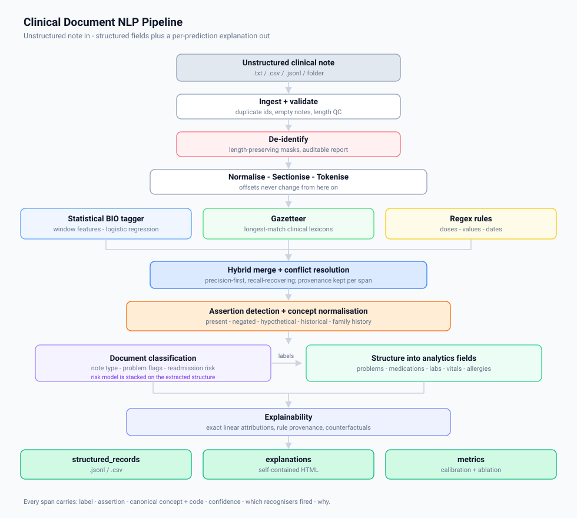

# Architecture

A stage-by-stage walkthrough of how a note becomes a row.

The pipeline is ten stages behind one class, `ClinicalNLPPipeline`. Each stage consumes and returns
the plain dataclasses in [`data/schema.py`](../src/clinical_nlp/data/schema.py) — `Span`, `Token`,
`Section`, `ClinicalDocument`, `StructuredRecord` — which keeps the contract between stages explicit
and makes any stage testable in isolation.



---

## The invariant everything rests on

**No stage mutates note text.**

Normalisation and de-identification are both *length-preserving*: NFKC folding maps to same-width
characters, and PHI is replaced by same-length masks rather than removed. Consequently gold
annotations, model predictions and explanation highlights all index into the same original
characters, and a span computed at stage 4 is still valid at stage 10.

This is why the HTML reports can highlight the clinician's own words rather than a reconstructed
string, and why the classifiers can read de-identified text while the tagger reads the original,
without the two views ever drifting apart. Any transformation that would change length belongs in
the concept-normalisation layer (which produces a *canonical name*, not new text), not in
preprocessing.

---

## Stage 1 — Ingest

`ingest/loaders.py`

Accepts the shapes clinical text actually arrives in: a folder of `.txt`, a `.csv`/`.tsv` export
with one row per note, a `.jsonl` dump, or this project's own annotated corpus format. All of them
yield a uniform stream of `ClinicalDocument`. Non-text columns are preserved as metadata rather than
discarded.

Ingestion is the only stage permitted to touch the filesystem; everything downstream operates on
in-memory documents, which is what lets the test suite run without fixtures on disk.

`validate()` runs basic QC first — duplicate ids, empty notes, suspiciously short notes, mean length
— and the CLI logs it. Silent ingestion failures are the cheapest bug to prevent and one of the most
expensive to discover later.

## Stage 2 — De-identify

`ingest/deid.py`

Pattern-based removal of the direct identifiers that structured EHR exports place in predictable
fields: MRNs, SSN-shaped strings, phone numbers, e-mail addresses, name fields, provider names, URLs.
Replacements are same-length masks and the returned `DeidReport` lists exactly what was removed and
where, so the redaction itself is auditable.

**This is a safety net, not a compliance control.** It will not catch identifiers buried in free-text
narrative, which is the hard part of de-identification. See the [model card](model_card.md).

It is applied in two places: optionally to the whole document (`--deid`), and *always* to the text
the document classifiers vectorise — see [Stage 7](#stage-7--document-classification) for why.

## Stage 3 — Normalise and sectionise

`preprocess/normalize.py`, `preprocess/sectionizer.py`

Normalisation folds the smart quotes, en-dashes and non-breaking spaces that survive EHR export,
without changing offsets.

Sectionisation matters more than it sounds. Clinical notes are semi-structured, and the same phrase
means different things in `PAST MEDICAL HISTORY` versus `ASSESSMENT AND PLAN`. An all-caps or
title-case line matching a known header pattern opens a section that runs until the next header;
aliases map onto canonical names (`MEDS`, `MEDICATION LIST`, `DISCHARGE MEDICATIONS` → `MEDICATIONS`;
`A/P`, `IMPRESSION` → `ASSESSMENT`). Unrecognised headers become `OTHER` rather than being dropped,
so no text is silently lost, and sections are guaranteed to tile the document with no gaps.

Section identity is one of the strongest features the tagger has, and the structuring layer uses it
to decide whether a medication mention belongs on the active list or is narrative.

## Stage 4 — Tokenise

`preprocess/tokenize.py`

Offset-preserving tokenisation with clinical-specific behaviour:

- `120/80`, `3.375`, `1,200` stay single tokens, so a vital or lab value lines up with one
  annotation instead of three.
- `A-fib`, `T2DM`, `q4h`, `s/p` survive as single word tokens.
- Sentence segmentation avoids splitting on the periods inside `Dr.`, `q.d.` and decimals, and
  treats a hard newline as a boundary (clinical "sentences" are frequently bullet lines).

Each token is stamped with its enclosing section.

## Stage 5 — Hybrid NER

`ner/tagger.py`, `ner/gazetteer.py`, `ner/rules.py`, `ner/pipeline.py`

Three recognisers with deliberately complementary error profiles:

| Component | Strength | Weakness |
| --- | --- | --- |
| Statistical BIO tagger | boundaries, context, unseen surface forms | needs training data |
| Gazetteer | known concepts, high precision | no boundary or context sense |
| Regex rules | generative patterns (`40 mg`, `148/92`, dates) | brittle outside the pattern |

**The tagger** is a `DictVectorizer` → `LogisticRegression` over windowed features: the token, a ±2
word window, orthographic shape, character affixes, gazetteer BIO tag, rule BIO tag, section, and
layout cues (bullet head, post-colon, line position). Decoding is greedy argmax followed by
`bio.repair`, which promotes orphaned `I-` tags to `B-` rather than dropping them — a slightly
mis-bounded entity is more useful to a reviewer than a silently discarded one.

**The merge** is precision-first and recall-recovering:

1. The tagger owns the span set.
2. A dictionary or rule match at *exactly* the same offsets and label upgrades the span's source to
   `hybrid` and adds a small confidence bonus.
3. Dictionary and rule matches that overlap nothing are added back, capped at a lower confidence and
   flagged as recovered.
4. Overlaps are resolved by source priority, then length, then score.

Every surviving span records which recognisers voted for it. On the test split that split is
directly usable: `hybrid` spans are 99.97% precise, `statistical`-only spans 97.6%.

## Stage 6 — Assertion and normalisation

`ner/context.py`, `HybridNER._normalize_concepts`

**Assertion detection** decides whether a mention is `present`, `negated`, `hypothetical`,
`historical` or `family_history`. A scoped trigger matcher in the NegEx / ConText tradition: a
trigger opens a scope, the scope runs forward to the entity unless a terminator (`but`, `however`,
`who presents with`) closes it first, and post-position triggers (`...was ruled out`,
`...discontinued`) handle cues that follow the concept. Terminators are word-bounded so `but` does
not fire inside `contributing`.

Every assignment reports the literal trigger, its character offset, and the scope text.

**Concept normalisation** attaches a canonical name and code: exact dictionary lookup first, then a
conservative fuzzy fallback (similarity ≥ 0.88, same entity type only) for typos and casing variants.
The cutoff is high on purpose — a wrong normalisation is worse than none, because it silently
corrupts every downstream count. Unmapped mentions are marked as such and surface in the record's
`quality` block.

## Stage 7 — Document classification

`classify/model.py`, `classify/structured_features.py`

Three tasks over a shared TF-IDF representation:

| Task | Type | Notes |
| --- | --- | --- |
| `note_type` | single-label | 4 classes |
| `problem_flags` | multi-label | one-vs-rest, per-label threshold |
| `readmission_risk` | ordinal | **stacked on the extraction stage** |

Two details are load-bearing.

**The token pattern keeps single characters** (`(?u)\b\w+\b`), because `(H)` and `(L)`
abnormal-result flags are among the most informative tokens in a clinical note and the scikit-learn
default silently drops them.

**Risk consumes the extraction output.** Readmission risk depends on counts — chronic problems,
results out of range, prior admissions, discharge destination — that a bag of n-grams represents
poorly. `structured_features.py` turns the predicted entities into indicator features
(`struct:n_chronic=3`, `struct:disposition=icu_transfer`, `struct:abnormal_labs=5`) that are hstacked
onto TF-IDF. Indicators rather than raw counts, so no feature scaling is needed and each one reads as
a plain statement in an explanation. At training time these features come from **predicted** entities
on the training notes, not gold ones — training on gold and serving on predictions is the classic
stacked-model leak. This moved risk macro-F1 from 0.53 to 0.74.

**Classifier input is de-identified.** The first version vectorised raw note text, and the global
explanation showed attending-physician names among the most heavily weighted risk features
(`dr delacroix` at rank 22 of 5,494 for the `low` class). The de-identifier now runs on the
classifier's text view, which cost 0.013 macro-F1 and removed a shortcut that would have transferred
to nothing.

## Stage 8 — Structure

`structure/assembler.py`

Where a list of spans becomes something an analyst can query: `problems[]`, `medications[]` with
dose/route/frequency/status, `labs[]` with value/unit/abnormal flag, `vitals[]`, `procedures[]`,
`allergies[]` with reaction, plus `negated_mentions[]`.

Two rules:

- **Attribute attachment is line-scoped.** Notes put one drug or one lab per line, so a dose binds to
  the drug on its own line rather than to the nearest drug in character distance.
- **Assertion decides inclusion.** Negated, hypothetical and family-history conditions never enter
  `problems`; they are preserved in `negated_mentions`, because "we looked and it was not there" is a
  different fact from "we never looked".

Each record also carries a `quality` block — low-confidence spans, unmapped concepts, medications
missing a dose, a completeness score and a `needs_review` boolean — so downstream users can triage
what to trust without re-deriving it.

## Stage 9 — Explain

`explain/attributions.py`, `explain/report.py`

Every prediction gets its evidence. Because the models are linear, the explanation *is* the
computation: `logit = b + Σ (feature value × weight)`, and the reported contributions are the largest
terms of that exact sum. Assertion decisions, being rule-based, report the literal trigger phrase.
See [`explainability.md`](explainability.md).

Outputs: a compact digest embedded in every structured record, full explanation objects in
`outputs/explanations/explanations.jsonl`, and self-contained HTML reports with the note highlighted
in place.

## Stage 10 — Evaluate and export

`evaluate/metrics.py`, `cli.py`

Span metrics under two matching criteria (strict = exact offsets + type; partial = overlap + type),
assertion accuracy measured only over strictly matched spans, per-class classification metrics,
multi-label micro/macro/exact-set/Jaccard, confidence calibration with expected calibration error,
a recogniser ablation, and per-stage throughput. Rendered to `metrics.md` and `metrics.json`.

---

## Data flow summary

```
ClinicalDocument(text)
  └─ .sections   ← detect_sections
  └─ .tokens     ← tokenize + assign_sections
  └─ .pred_spans ← HybridNER.predict     (label, assertion, normalized, score, explanation)
  └─ .pred_labels ← DocumentClassifierBundle.predict
  └─ .explanations ← document_explanation
        ↓
StructuredRecord  →  jsonl / csv / HTML report
```

## Extension points

| To change | Touch |
| --- | --- |
| Tagger backend (e.g. a transformer) | `ner/tagger.py` — implement `fit` / `predict_document`; `HybridNER` merges whatever it gets |
| Terminology (SNOMED CT, RxNorm, UMLS) | `data/lexicons.py` + `Gazetteer` entries; downstream depends only on `(label, canonical, code)` |
| Assertion cue set | `data/lexicons.py` trigger lists; scoping logic is separate in `ner/context.py` |
| New entity type | `ENTITY_TYPES` in `data/schema.py`, plus a generator writer |
| New document label | Add a classifier to `DocumentClassifierBundle` |
| Structuring rules | `structure/assembler.py` |
| Report look and feel | `explain/report.py` (`_CSS` and the card renderers) |

## Performance

Mean per note on a single CPU core, from `outputs/metrics.json`:

| Stage | ms |
| --- | --- |
| preprocess | 0.6 |
| NER | 18.3 |
| classify | 4.5 |
| explain | 32.6 |
| structure | 0.5 |
| **total** | **56.5** |

Explanation is the most expensive stage — it is doing per-span attribution plus counterfactual
occlusion. Set `output.max_entities_explained` in the config to cap it, or drop the occlusion pass,
if throughput matters more than completeness for your use case.
